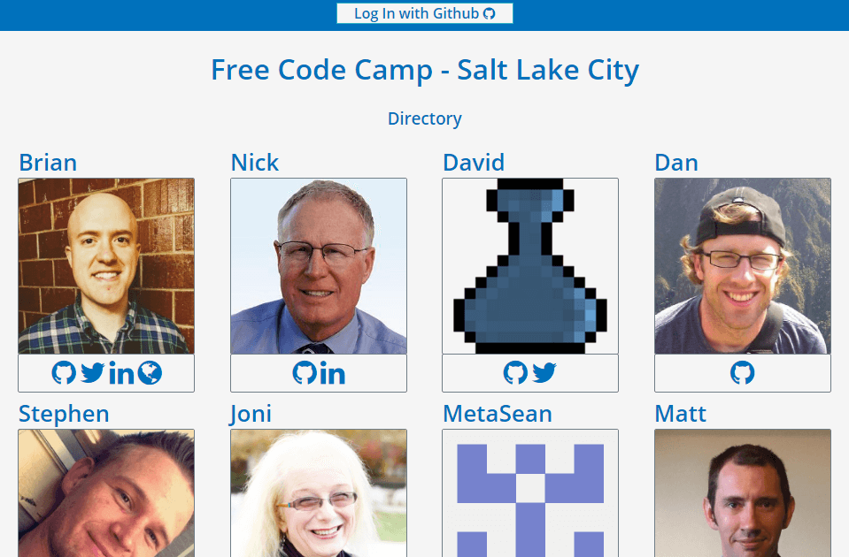

See server side code at https://github.com/briancbarrow/fcc-directory-server

FreeCodeCamp Salt Lake City
=====
This Project is built to provide a common location for members of the Free Code Camp meetup group in Salt Lake City
---

To join, a member needs to only click the login button located in the header and accept the app to access your GitHub information.

Once logged in a user can click the menu button in the top right hand corner to add/edit their social media links and portfolio information.

